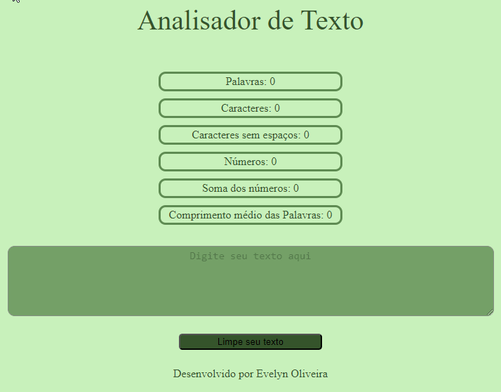

<h1 align="center"> Analisador de Texto</h1>

##  Descrição

Aplicação web criada para fazer analíse de textos em geral, seguindo critérios pré estabelecidos no readme da Lab.

Experimente o <a href="https://evy-oliveira.github.io/SAP012-text-analyzer/" target="_blank">Analisador de Texto</a>

## Índice

- [Descrição](#Descrição)
- [Índice](#índice)
- [Considerações gerais](#considerações-gerais)
- [Aprendizado](#aprendizado)
- [Funcionalidades](#funcionalidades)
- [Status do Projeto](#status-do-projeto)
- [Testes](#testes)
- [Tecnologias Utilizadas](#tecnologias-utlizadas)
- [Autora](#autora)

---

## Considerações gerais

- Exercitei a escrita de um readme estruturado e objetivo.
- O [projeto](https://evy-oliveira.github.io/SAP012-text-analyzer/) foi feito individualmente, porém houve muita troca de dicas com as outras colegas(que foi super importante).
- Terminei o [projeto](https://evy-oliveira.github.io/SAP012-text-analyzer/) na terceira sprint.
- Procurei fazer de forma mais simples possível, pra que pudesse entender o que estava acontecendo no código.

---

## Aprendizado

📌
📌
📌
📌
📌
📌
📌

---

## Funcionalidades

👍🏼 A aplicação permite digitar um texto em uma caixa de texto.

👍🏼 A aplicação tem as seguintes funções:
 
    📌Contagem de palavras: faz a contagem das palavras encontradas no texto.
    📌Contagem de caracteres: faz a contagem dos caracteres encontrados no texto, incluindo espaços e sinais de
    pontuação.
    📌Contagem de caracteres excluindo espaços e sinais de pontuação: faz a contagem dos caracteres excluindo espaços e sinais de pontuação encontrados no texto.
    📌Comprimento médio das palavras: mostra comprimento médio das palavras encontradas no texto.
    📌Contagem de números: faz a contagem de quantos números foram encontrados no texto.
    📌Soma total dos números: faz a soma de todos os números que estão no texto e mostra o resultado.
  
👍🏼 A aplicação limpa a caixa de texto e o conteudo dos contadores ao clicar no botão"Limpe seu texto".

 

---

## Status do projeto
<h4 align="center">✨Finalizado✨</h4>

---

## 🔎Testes🔍
  - [x] `npm run test:oas-html`
  - [x] `npm run test:oas-css`
  - [x] `npm run test:oas-web-api`
  - [x] `npm run test:oas-js`
  - [x] `run test`
  - [x] `run test:e2e`

---

## Tecnologias Utilizadas

👉🏼 [Html](https://html.spec.whatwg.org/)
👉🏼 [Css](https://developer.mozilla.org/pt-BR/docs/Web/CSS)
👉🏼 [JavaScript](https://www.freecodecamp.org/portuguese/news/o-manual-de-javascript-para-iniciantes/)
👉🏼 [Node.js](https://nodejs.org/en)
👉🏼 [Git](https://git-scm.com/)
👉🏼 [GitHub](https://github.com/)

---

## Autora

Desenvolvido com ❤️ por <a href="https://evy-oliveira.github.io/portfolio-profissional/" target="_blank">Evelyn Oliveira</a>
